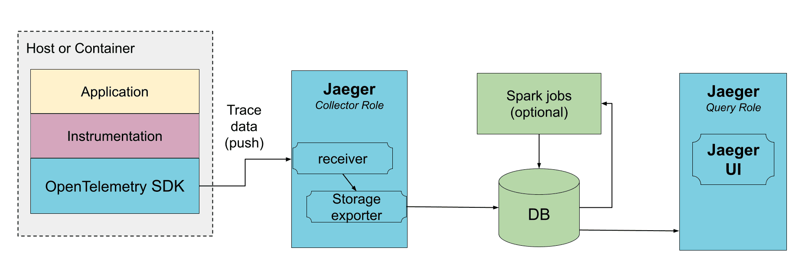
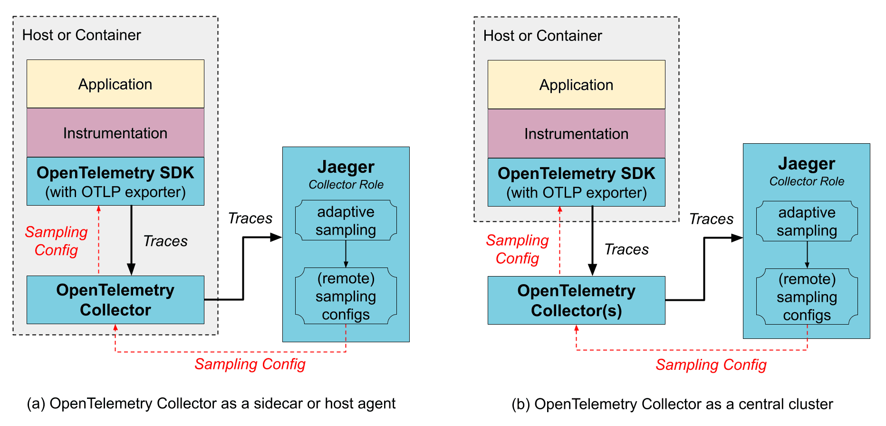
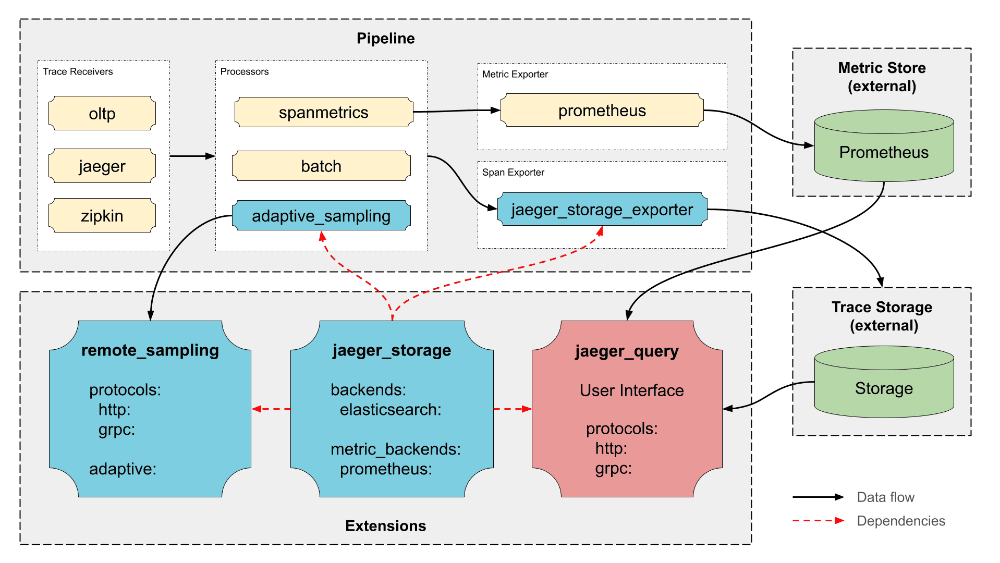

# Architecture

**Alauda Distributed Tracing** is based on Jaeger v2 and Alauda Build of OpenTelemetry v2. Jaeger instances are deployed through the OpenTelemetry Operator, and Elasticsearch is used as the backend storage. In this architecture, Jaeger v2 provides the core tracing backend capabilities for data ingestion, query, and visualization.

**Jaeger v2** is designed to be a versatile and flexible tracing platform. It can be deployed as a single binary that can be configured to perform different **roles** within the Jaeger architecture.

## Roles

* **collector**: Receives incoming trace data from applications and writes it into a storage backend.
* **query**: Serves the APIs and the user interface for querying and visualizing traces.
* **es-rollover**: Manages Elasticsearch rollover-based index operations for Jaeger. It is used to prepare aliases, indices, and templates for rollover deployments, and can periodically roll the write alias to a new index while updating read aliases.

## Storage architecture

### Direct to storage

In this deployment the **collector**s receive the data from traced applications and write it directly to storage. The storage must be able to handle both average and peak traffic. The **collector**s may use an in-memory queue to smooth short-term traffic peaks, but a sustained traffic spike may result in dropped data if the storage is not able to keep up.

## With OpenTelemetry Collector

You **do not need** to use the OpenTelemetry Collector to operate Jaeger, because Jaeger is a customized distribution of the OpenTelemetry Collector with different roles. However, if you already use the OpenTelemetry Collectors, for gathering other types of telemetry or for pre-processing / enriching the tracing data, it can be placed _in front of_ Jaeger in the collection pipeline. The OpenTelemetry Collectors can be run as an application sidecar, or as a remote service cluster.

The OpenTelemetry Collector supports Jaeger's Remote Sampling protocol and can either serve static configurations from config files directly, or proxy the requests to the Jaeger backend (e.g., when using adaptive sampling).

### OpenTelemetry Collector as a sidecar / host agent

**Benefits**:

* The SDK configuration is simplified as both trace export endpoint and sampling config endpoint can point to a local host and not worry about discovering where those services run remotely.
* Collector may provide data enrichment by adding environment information, like k8s pod name.
* Resource usage for data enrichment can be distributed across all application hosts.

**Downsides**:

* An extra layer of marshaling/unmarshaling the data.

### OpenTelemetry Collector as a remote cluster

**Benefits**:

* Sharding capabilities, e.g., when using [tail-based sampling](https://github.com/open-telemetry/opentelemetry-collector-contrib/blob/main/processor/tailsamplingprocessor/README.md).

**Downsides**:

* An extra layer of marshaling/unmarshaling the data.

## Jaeger Binary

The Jaeger binary is build on top of the OpenTelemetry Collector framework and includes:

* Official upstream components, such as OTLP Receiver, Batch and Attribute Processor, etc.
* Upstream components from `opentelemetry-collector-contrib`, such as Kafka Exporter and Receiver, Tail Sampling Processor, etc.
* Jaeger own components, such as Jaeger Storage Exporter, Jaeger Query Extension, etc.

### Jaeger Components

* [Jaeger Storage Extension](https://github.com/alauda-mesh/jaeger/tree/v2.16.0/cmd/jaeger/internal/extension/jaegerstorage) - Extensible hub for storage backends supported in Jaeger. It provides all other Jaeger components access to Jaeger storage implementations.
* [Jaeger Storage Exporter](https://github.com/alauda-mesh/jaeger/tree/v2.16.0/cmd/jaeger/internal/extension/jaegerstorage) - Writes spans to storage backend configured in the Jaeger Storage Extension.
* [Jaeger Query Extension](https://github.com/alauda-mesh/jaeger/tree/v2.16.0/cmd/jaeger/internal/extension/jaegerquery) - Run the query APIs and the Jaeger UI.
* [Adaptive Sampling Processor](https://github.com/alauda-mesh/jaeger/tree/v2.16.0/cmd/jaeger/internal/processors/adaptivesampling) - Performs probabilities calculations for adaptive sampling.
* [Remote Sampling Extension](https://github.com/alauda-mesh/jaeger/tree/v2.16.0/cmd/jaeger/internal/extension/remotesampling) - Serves the endpoints for Remote Sampling, based on static configuration file or adaptive sampling.

### OpenTelemetry Components

#### Receivers

* [OTLP](https://github.com/open-telemetry/opentelemetry-collector/tree/main/receiver/otlpreceiver) - Accepts spans sent via OpenTelemetry Protocol (OTLP).
* [Jaeger](https://github.com/open-telemetry/opentelemetry-collector-contrib/tree/main/receiver/jaegerreceiver) - Accepts Jaeger formatted traces transported via gRPC or Thrift protocols.
* [Kafka](https://github.com/open-telemetry/opentelemetry-collector-contrib/tree/main/receiver/kafkareceiver) - Accepts spans from Kafka in various formats (OTLP, Jaeger, Zipkin).
* [Zipkin](https://github.com/open-telemetry/opentelemetry-collector-contrib/tree/main/receiver/zipkinreceiver) - Accepts spans using Zipkin v1 and v2 protocols.
* [No-op](https://github.com/open-telemetry/opentelemetry-collector/tree/main/receiver/nopreceiver) - Used for Jaeger UI / query service deployment that does not require an ingestion pipeline.

#### Processors

* [Batch Processor](https://github.com/open-telemetry/opentelemetry-collector/tree/main/processor/batchprocessor) - Batches spans for better efficiency.
* [Tail Sampling](https://github.com/open-telemetry/opentelemetry-collector-contrib/tree/main/processor/tailsamplingprocessor) - Supports advanced post-collection sampling.
* [Memory Limiter](https://github.com/open-telemetry/opentelemetry-collector/tree/main/processor/memorylimiterprocessor) - Supports back-pressure when the collector is overloaded.
* [Attributes Processor](https://github.com/open-telemetry/opentelemetry-collector-contrib/tree/main/processor/attributesprocessor) - Allows filtering, rewriting, and enriching spans with attributes. Can be used to redact sensitive data, reduce data volume, or attach environment information.
* [Filter Processor](https://github.com/open-telemetry/opentelemetry-collector-contrib/tree/main/processor/filterprocessor) - Allows dropping spans and span events from the collector (⚠️ may cause broken traces).

#### Exporters

* [OTLP](https://github.com/open-telemetry/opentelemetry-collector/tree/main/exporter/otlpexporter) - Send data in OTLP format via gRPC.
* [OTLP HTTP](https://github.com/open-telemetry/opentelemetry-collector/tree/main/exporter/otlphttpexporter) - Sends data in OTLP format over HTTP.
* [Kafka](https://github.com/open-telemetry/opentelemetry-collector-contrib/blob/main/exporter/kafkaexporter/) - Sends data to Kafka in various formats (OTLP, Jaeger, Zipkin).
* [Prometheus](https://github.com/open-telemetry/opentelemetry-collector-contrib/tree/main/exporter/prometheusexporter) - Sends metrics to Prometheus.
* [Debug](https://github.com/open-telemetry/opentelemetry-collector/tree/main/exporter/debugexporter) - Debugging tool for pipelines.
* [No-op](https://github.com/open-telemetry/opentelemetry-collector/tree/main/exporter/nopexporter) - Used for Jaeger UI / query service deployment that does not require an ingestion pipeline.

#### Connectors

* [Span Metrics](https://github.com/open-telemetry/opentelemetry-collector-contrib/blob/main/connector/spanmetricsconnector/) - Generates metrics from span data.
* [Forward](https://github.com/open-telemetry/opentelemetry-collector/blob/main/connector/forwardconnector/) - Redirects telemetry between pipelines in the collector (ex: span to metric / span to log)

#### Extensions

* [Health Check v2](https://github.com/open-telemetry/opentelemetry-collector-contrib/tree/main/extension/healthcheckv2extension) - Supports health checks.
* [zPages](https://github.com/open-telemetry/opentelemetry-collector/tree/main/extension/zpagesextension) - Exposes internal state of the collector for debugging.
* [Performance Profiler (pprof)](https://github.com/open-telemetry/opentelemetry-collector-contrib/tree/main/extension/pprofextension) - enables Go's `net/http/pprof` endpoint, typically used by developers to collect performance profiles and investigate issues with the collector.
