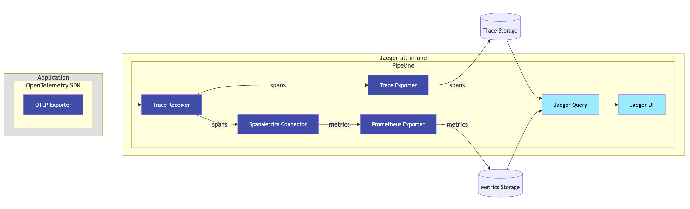

# Service Performance Monitoring (SPM)

Service Performance Monitoring surfaces in Jaeger UI as the "Monitor" tab and helps identify interesting traces without requiring prior knowledge of service or operation names. The feature aggregates span data to produce RED (Request, Error, Duration) metrics.

## UI Feature Overview

The Monitor tab provides service-level and operation-level aggregation of:

- Request rates
- Error rates
- Durations (P95, P75, P50)

An "Impact" metric is computed as the product of latency and request rate, helping identify operations with high business impact despite varied latency profiles.

## Architecture

The SpanMetrics Connector receives spans and generates metrics exported to a PromQL-compatible backend. Jaeger Query then retrieves these pre-computed metrics. This approach requires:

- A [SpanMetrics Connector](https://github.com/open-telemetry/opentelemetry-collector-contrib/blob/main/connector/spanmetricsconnector/README.md) is introduced in the pipeline that receives trace data (spans) and generates RED metrics.
- An external Metrics Store that supports PromQL queries.
- A configuration in the `jaeger_query` extension to reference the external metrics store.



### Derived Time Series

The SpanMetrics Connector generates two metric names:

**`traces_span_metrics_calls`** (counter type)

- Counts total spans, including error spans
- Call counts differentiated from errors via the `status_code` label
- Errors identified as time series with label `status_code = "STATUS_CODE_ERROR"`

**`traces_span_metrics_duration`** (histogram type)

- Histogram of span durations/latencies
- Creates additional time series:
  - `traces_span_metrics_duration_count`: Total data points across buckets
  - `traces_span_metrics_duration_sum`: Sum of all data point values
  - `traces_span_metrics_duration_bucket`: Collection of time series for each bucket

Estimated time series calculation:

```
num_status_codes * num_span_kinds * (1 + num_latency_buckets) * num_operations

Typical: 72 * num_operations
Max: 324 * num_operations
```

## Configuration

Enable the SpanMetrics Connector in your OpenTelemetry Collector pipeline:

```yaml
exporters:
  prometheus:
    endpoint: "0.0.0.0:8889"
    # other prometheus options

connectors:
  spanmetrics:
    # connector configuration options

service:
  pipelines:
    traces:
      receivers: [otlp]
      processors: [memory_limiter, batch]
      exporters: [debug, spanmetrics]
    metrics/spanmetrics:
      receivers: [spanmetrics]
      exporters: [prometheus]
```

Define a remote PromQL-compatible storage in Jaeger:

```yaml
extensions:
  jaeger_storage:
    backends:
      some_trace_storage:
        ...
    metric_backends:
      some_metrics_storage:
        prometheus:
          endpoint: http://prometheus:9090
```

Reference the metrics store in the `jaeger_query` extension:

```yaml
extensions:
  jaeger_query:
    traces: some_trace_storage
    metrics: some_metrics_storage
```
