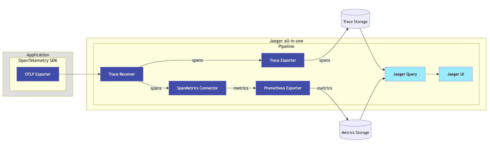

# Service Performance Monitoring (SPM)

Service Performance Monitoring surfaces in Jaeger UI as the "Monitor" tab and helps identify interesting traces without requiring prior knowledge of service or operation names. The feature aggregates span data to produce RED (Request, Error, Duration) metrics.

## UI Feature Overview

The Monitor tab provides service-level and operation-level aggregation of:

- Request rates
- Error rates
- Durations (P95, P75, P50)

An "Impact" metric is computed as the product of latency and request rate, helping identify operations with high business impact despite varied latency profiles.

## Architecture

The SpanMetrics Connector receives spans and generates metrics exported to a PromQL-compatible backend. Jaeger Query then retrieves these pre-computed metrics. This approach requires:

- A [SpanMetrics Connector](https://github.com/open-telemetry/opentelemetry-collector-contrib/blob/main/connector/spanmetricsconnector/README.md) is introduced in the pipeline that receives trace data (spans) and generates RED metrics.
- An external Metrics Store that supports PromQL queries.
- A configuration in the `jaeger_query` extension to reference the external metrics store.

Because the connector aggregates spans into in-memory series, each `(service, operation)` time series must be produced by a **single writer**. With one collector replica this holds automatically. To scale out, spans must be load-balanced **by `service`** so that every service is aggregated on exactly one instance; otherwise the RED metrics are double-counted and become inaccurate. See [Configuration](#configuration) for the resulting two-tier setup.



### Derived Time Series

The SpanMetrics Connector generates two metric names:

**`traces_span_metrics_calls`** (counter type)

- Counts total spans, including error spans
- Call counts differentiated from errors via the `status_code` label
- Errors identified as time series with label `status_code = "STATUS_CODE_ERROR"`

**`traces_span_metrics_duration`** (histogram type)

- Histogram of span durations/latencies
- Creates additional time series:
  - `traces_span_metrics_duration_count`: Total data points across buckets
  - `traces_span_metrics_duration_sum`: Sum of all data point values
  - `traces_span_metrics_duration_bucket`: Collection of time series for each bucket

Estimated time series calculation:

```
num_status_codes * num_span_kinds * (1 + num_latency_buckets) * num_operations

Typical: 72 * num_operations
Max: 324 * num_operations
```

## Configuration \{#configuration}

SPM runs in two tiers so that the stateful SpanMetrics Connector always sees each service from a single writer, which keeps the RED metrics accurate even when both tiers run with multiple replicas.

**Front OpenTelemetry Collector** — load-balance spans to the backend by `service`:

```yaml
exporters:
  loadbalancing:
    routing_key: service # all spans of a service go to the same backend instance
    protocol:
      otlp:
        tls:
          insecure: true
    resolver:
      dns:
        hostname: jaeger-collector-headless.jaeger.svc.cluster.local
        port: "4317" # the dns resolver requires the port as a string

service:
  pipelines:
    traces:
      receivers: [otlp]
      processors: [memory_limiter, batch]
      exporters: [debug, loadbalancing]
```

**Jaeger** — run the SpanMetrics Connector and expose the generated metrics on a Prometheus endpoint:

```yaml
exporters:
  prometheus:
    translation_strategy: UnderscoreEscapingWithoutSuffixes # keep OTel metric names without _total suffixes (add_metric_suffixes is deprecated and ignored since Jaeger v2.20.0 / collector-contrib v0.154.0)
    endpoint: "0.0.0.0:8889"
    resource_to_telemetry_conversion:
      enabled: true

connectors:
  spanmetrics:
    # connector configuration options

service:
  pipelines:
    traces:
      exporters: [jaeger_storage_exporter, spanmetrics]
    metrics/spanmetrics:
      receivers: [spanmetrics]
      exporters: [prometheus]
```

:::note
The exporter and the Jaeger metrics reader must agree on metric names. By default Jaeger queries suffix-less names such as `traces_span_metrics_calls` (the `normalize_calls` and `normalize_duration` options of the `prometheus` metric backend default to `false`), so the exporter must not append Prometheus-style suffixes. Set `translation_strategy: UnderscoreEscapingWithoutSuffixes` explicitly for this: the older `add_metric_suffixes: false` option is deprecated and silently ignored since Jaeger v2.20.0 (collector-contrib v0.154.0), which would rename the metrics to `traces_span_metrics_calls_total` and break the Monitor tab.
:::

Define a remote PromQL-compatible storage in Jaeger:

```yaml
extensions:
  jaeger_storage:
    backends:
      some_trace_storage:
        ...
    metric_backends:
      some_metrics_storage:
        prometheus:
          endpoint: http://prometheus:9090
```

Reference the metrics store in the `jaeger_query` extension:

```yaml
extensions:
  jaeger_query:
    traces: some_trace_storage
    metrics: some_metrics_storage
```
